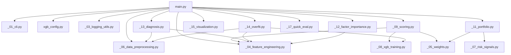

# ml_models

本目录包含用于多因子选股/权重生成的模型脚本与其模块化组件。目前主要入口为：

- [main.py](file:///Users/zhuzhuxia/Documents/SZU_w4/ml_models/main.py)：基于 XGBoost（可选融合 KNN）的日频滚动训练与打分，生成逐日权重文件；内置“创业板+科创板”收缩股票池与“趋势/动量”为主的默认配置；支持诊断模式与过拟合自检。
- [xgb_config.py](file:///Users/zhuzhuxia/Documents/SZU_w4/ml_models/xgb_config.py)：默认配置集中管理（数据/模型/训练/组合/择时等）。
- [model_functions/](file:///Users/zhuzhuxia/Documents/SZU_w4/ml_models/model_functions)：功能模块拆分（数据预处理、特征工程、训练、评估、可视化、组合构建等）。

兼容性说明：
- [xgb_knn_runner_tech.py](file:///Users/zhuzhuxia/Documents/SZU_w4/ml_models/xgb_knn_runner_tech.py) 仍可作为旧入口使用（会直接转到 `main.py` 执行）。

---

## 激活环境

source /Users/zhuzhuxia/Documents/SZU_w4/.venv/bin/activate

## 程序结构与运行方式

> 注：大部分 `_xx_*.py` 模块为内部函数库，不支持直接运行，需通过 `main.py` 配合不同参数调用。

```
ml_models/
  main.py                     # 主入口 -> python ml_models/main.py --help
  xgb_config.py               # 静态配置 -> (不可运行，仅供导入)
  xgb_knn_runner_tech.py      # 旧入口 -> python ml_models/xgb_knn_runner_tech.py ...
  model_functions/
    _01_cli.py                # 参数解析 -> python ml_models/main.py --help
    _02_parsing_utils.py      # 工具函数 -> (内部库)
    _03_logging_utils.py      # 日志工具 -> (内部库)
    _04_feature_engineering.py# 特征工程 -> (内部库，主流程自动调用)
    _05_weights.py            # 权重计算 -> (内部库，主流程自动调用)
    _06_data_preprocessing.py # 数据预处理 -> (内部库，主流程自动调用)
    _07_risk_signals.py       # 风控信号 -> (内部库，--timing-method index_ma20 时调用)
    _08_xgb_training.py       # 模型训练 -> (内部库，主流程自动调用)
    _09_scoring.py            # 预测打分 -> (内部库，主流程自动调用)
    _10_evaluation.py         # 评估指标 -> (内部库)
    _11_portfolio.py          # 组合构建 -> (内部库，主流程自动调用)
    _12_factor_importance.py  # 因子重要性 -> (内部库，主流程结束前自动调用)
    _13_diagnosis.py          # 因子诊断 -> python ml_models/main.py --diagnose ...
    _14_overfit.py            # 过拟合自检 -> python ml_models/main.py --overfit-check ...
    _15_visualization.py      # 可视化绘图 -> (内部库)
    _16_run_params.py         # 参数记录 -> (内部库)
    _17_quick_eval.py         # 快速评估 -> python ml_models/main.py --quick-eval ...
```

---

## 模块依赖关系图



---

## 运行概览（与原逻辑一致）

### 核心思路

- **股票池**：仅保留代码前缀为 `300`（创业板）与 `688`（科创板）的股票。
- **特征**：读取本地因子面板（MultiIndex：`date, code`），对每只股票做 `shift(1)`，避免未来函数。
- **标签（Label）**：计算未来 **5 个交易日**开盘买入口径收益 `ret_next_raw = (open_{t+5} - open_t) / open_t`，再减去同日基准（默认：**可交易股票池的横截面中位数**）得到超额收益 `ret_next`。
- **训练方式**：对每个交易日滚动用过去 `train_window` 天训练一次，输出当天全股票池的预测分数。
- **持仓生成**：对预测分数做 `smooth_window` 日均值平滑，用“TopK 买入 / TopBuffer 持有”缓冲区 + 惯性因子 + 调仓周期控制换手，并输出逐日权重 CSV。
- **可交易过滤（用于标签/候选过滤）**：要求 `open>0`；若存在 `upper_limit` 则要求 `open<upper_limit`（避免涨停不可买）；若存在 `turnover_prev` 则要求 `turnover_prev > 1500万`。
- **行业模块（可选）**：在组合构建阶段对候选名单做行业层面的“禁新/配额/风控”，防止单行业过度集中；可用 `--no-industry-enable` 一键关闭。

---

## 输入数据

脚本内置了固定路径（如需迁移，可直接在脚本顶部改常量）：

- 因子数据：`/Users/zhuzhuxia/Documents/SZU_w4/factors_data/all_factors_with_fundamentals.parquet`
- 价格数据：`/Users/zhuzhuxia/Documents/SZU_w4/pre_data/cleaned_stock_data_300_688_with_idxstk_with_industry.parquet`
- 风控数据（当 `--timing-method index_ma20/index_ma_dual/split_index_ma20` 时使用；或 QuickEval 选择“指数基准”时使用）：`/Users/zhuzhuxia/Documents/SZU_w4/pre_data/merged_20200101_20241231.csv`（读取指数 `close` 计算 MA，并默认用前一交易日信号）

期望格式：

- 因子数据需包含 MultiIndex：`date, code`（或包含 `date/code` 列可自动转为 MultiIndex）。
- 价格数据需包含 MultiIndex：`date, code`，至少包含 `open/close`，建议包含 `upper_limit/lower_limit/turnover`（用于可交易与涨跌停判断）。

---

## 输出结果

### 1) 权重文件（逐日）

- 输出目录：`/Users/zhuzhuxia/Documents/SZU_w4/ml_results/xgb_results_gem_star_momo`
- 文件名：`YYYYMMDD.csv`
- 格式：无表头，两列（`code, weight`）

注意：每次运行会自动清空该目录下旧的 `*.csv`（避免“上次权重未覆盖干净”）。

### 2) 临时分数文件

- 目录：`/Users/zhuzhuxia/Documents/SZU_w4/ml_results/temp_scores_gem_star_momo`
- 文件名：`YYYYMMDD.parquet`
- 内容：当天的候选股票分数（脚本会在运行开始时删除并重建该目录）。

### 3) 因子重要性

- 目录：`/Users/zhuzhuxia/Documents/SZU_w4/ml_results/factors_importance`
- 文件：`factor_importance_*.csv / *.meta.json / *.brief.txt`
- 说明：用最后一个预测日对应训练集拟合一次 XGBoost，输出 gain/weight/cover 以及与标签的 spearman 相关等摘要。

---

## 快速开始

### 生成权重（正常模式）

在工程根目录执行：

```bash
python "/Users/zhuzhuxia/Documents/SZU_w4/ml_models/main.py" \
  --start-date 20230101 \
  --end-date 20241231 \
  --timing-method index_ma20 \
  --risk-index-code 399006
  --n-workers 8 \
  --quick-eval
```

说明：

- 默认已启用“自算全样本等权指数 MA20”择时：`--timing-method self_eq_ma20`，并把 `risk_index_code` 设为 `self_eq`（见 `xgb_config.py`）。
- 该默认择时不依赖外部指数数据（只用 price_data 的全样本 close 计算等权指数与 MA，并使用前一交易日信号，避免同日未来信息）。

如果你希望关闭行业相关逻辑（不做行业配额/行业风控），可以加：

```bash
python "/Users/zhuzhuxia/Documents/SZU_w4/ml_models/main.py" \
  --start-date 20230101 \
  --end-date 20241231 \
  --timing-method index_ma20 \
  --risk-index-code 399006 \
  --n-workers 8 \
  --quick-eval \
  --no-industry-enable
```

如果你想复测“原先的指数 MA20”（创业板指 399006）而不训练（只复测已有权重文件）：

```bash
python "/Users/zhuzhuxia/Documents/SZU_w4/ml_models/main.py" \
  --quick-eval-only \
  --timing-method index_ma20 \
  --risk-index-code 399006
```

### 行业模块（可选）

行业相关逻辑发生在 [ _11_portfolio.py](file:///Users/zhuzhuxia/Documents/SZU_w4/ml_models/model_functions/_11_portfolio.py) 的组合构建阶段，核心目标是：在“已选股”的前提下，做行业层面的资金与风险敞口管理。

- **Risk-Off 行业禁新**：当某行业处于 Risk-Off 状态时，对该行业执行 `ban_new`（不允许新增该行业仓位），避免逆势加仓。
- **行业配额/分散度**：按行业强弱分组分配名额，并尽量保证至少覆盖 `industry_min_industries` 个行业（默认 4）。
- **单行业权重硬顶**：若某行业总权重超过 `industry_max_weight`（默认 0.30），该行业内权重按比例缩放，削减部分直接转为现金（降低总仓位）。
- **Risk-Off 持仓降权**：对 Risk-Off 行业的“老持仓”按 `industry_riskoff_weight_scale`（默认 0.5）缩放，降低风险暴露但不强制清仓。
- **极速反转信号（A）**：当 `industry_riskoff_policy=ban_new` 时，若某行业仍处于 Risk-Off，但前一日出现“极速反转”信号，则允许该行业在当日开少量新仓；这些“极速反转新仓”的买入权重会乘 `industry_fast_reversal_observe_scale`（默认 0.5），未分配资金转为现金。信号构造使用前一日数据（shift(1)），避免同日未来信息：行业指数仍在 MA(`industry_ma_window`) 下方 & 行业当日涨幅 > `industry_fast_reversal_ret_threshold`（默认 3%）& 行业成交量/换手放大（`industry_fast_reversal_vol_window` 日均值的 `industry_fast_reversal_vol_mult` 倍，默认 20 日、1.5 倍）。
- **牛市动态行业硬顶（B）**：当指数（`risk_index_code`）前一日收盘 > MA(`industry_bull_ma_window`，默认 60) 时视为“牛市”，单行业上限从 `industry_max_weight`（默认 0.30）临时提升到 `industry_bull_max_weight`（默认 0.60）；超出部分仍按比例缩放、资金变现金。

默认开关（见 [xgb_config.py](file:///Users/zhuzhuxia/Documents/SZU_w4/ml_models/xgb_config.py)）：

- `industry_enable=True`
- `industry_fast_reversal_enable=True`
- `industry_bull_enable=True`

常用参数（均可 `--help` 查看；默认值在 [xgb_config.py](file:///Users/zhuzhuxia/Documents/SZU_w4/ml_models/xgb_config.py)）：

- 开关：`--industry-enable / --no-industry-enable`
- 行业映射：`--industry-map-path`
- 信号窗口：`--industry-mom-window`、`--industry-ma-window`、`--industry-ma-riskoff-buffer`
- 风控参数：`--industry-max-weight`、`--industry-riskoff-weight-scale`、`--industry-riskoff-policy`
- 极速反转（A）：`--industry-fast-reversal-enable / --no-industry-fast-reversal-enable`、`--industry-fast-reversal-ret-threshold`、`--industry-fast-reversal-vol-window`、`--industry-fast-reversal-vol-mult`、`--industry-fast-reversal-observe-scale`
- 牛市硬顶（B）：`--industry-bull-enable / --no-industry-bull-enable`、`--industry-bull-ma-window`、`--industry-bull-max-weight`
- 分组配额：`--industry-strong-max-count`、`--industry-neutral-max-count`、`--industry-weak-max-count`、`--industry-unknown-max-count`

运行输出示例（部分）：
```text
[配置参数]
┌── 基础路径
│ output_dir: ...   sub_dir_name: xgb_results_gem_star_momo
...
┌── 模型参数
│ n_estimators: 200   learning_rate: 0.01   max_depth: 4
...
```

运行输出示例（参数汇总片段，关闭行业 enable；终端仅展示每组前几行，完整参数见 log_file）：
```text
(SZU_w4) zhuzhuxia@zhuzhuxiadeMacBook-Pro SZU_w4 % python "/Users/zhuzhuxia/Documents/SZU_w4/ml_models/main.py" \
  --start-date 20230101 \
  --end-date 20241231 \
  --no-industry-enable
log_file=/Users/zhuzhuxia/Documents/SZU_w4/ml_results/logs/xgb_knn_runner_20260102_010225.log
[01:02:25] ========== 配置参数 (Config) ==========
┌── 基础路径
│ factor_data_path: /Users/zhuzhuxia/Documents/SZU_w4/factors_data/...
│ factors_importance_dir: /Users/zhuzhuxia/Documents/SZU_w4/ml_results/...
│ industry_map_path: /Users/zhuzhuxia/Documents/SZU_w4/data_preprocess/...
│ ... (省略3行，详见日志文件)
┌── 模型参数
│ blend_knn_weight: 0.3   blend_xgb_weight: 0.7   knn_neighbors: 50   learning_rate: 0.01
│ max_depth: 4   n_estimators: 200   reg_lambda: 10.0   subsample: 0.7   use_constraints: False
│ ... (省略1行，详见日志文件)
┌── 训练设置
│ decay_anchor_days: 30   decay_half_life_days: 60   decay_min_weight: 0.1
│ dropna_features: False   n_workers: 10   sample_weight_mode: time_decay_exp   train_gap: 6
│ ... (省略1行，详见日志文件)
┌── 组合风控
│ band_threshold: 0.001   buffer_k: 30   emergency_exit_rank: 50   industry_enable: False
│ industry_ma_riskoff_buffer: 0.01   industry_ma_window: 20   industry_max_weight: 0.3
│ ... (省略4行，详见日志文件)
┌── 择时参数
│ risk_index_code: self_eq   risk_ma_buffer: 0.005   risk_ma_fast_window: 5
│ risk_ma_slow_window: 20   risk_ma_window: 20   timing_bad_exposure: 0.4
│ ... (省略1行，详见日志文件)
[01:02:25] ========== 数据集处理 (Dataset) ==========
step=load_factors path=/Users/zhuzhuxia/Documents/SZU_w4/factors_data/all_factors_with_fundamentals.parquet
泄漏检查 gap=6 | 标签最远=+5日 | 安全gap>=6 | 风险=0 | 最贴近标签点=target-1 (train_end+5)
步骤: 特征平移 shift=1
步骤: 加载价格数据 path=/Users/zhuzhuxia/Documents/SZU_w4/pre_data/cleaned_stock_data_300_688_with_idxstk_with_industry.parquet
步骤: 构建标签 label=5日收益
步骤: 合并特征与标签 (Inner Join)
数据集样本数=1355256
数据集日期范围=20200228~20241224 (end_date=20241231)
[01:02:28] ========== 特征工程 (Features) ==========
最终特征数=32 示例=['boll_pct_b', 'boll_width', 'breakout_20', 'breakout_20_vol_confirm', 'breakout_60', 'breakout_60_vol_confirm', 'candle_body', 'hl_ratio']
预测区间 20230103~20241224 总天数=479
```

如果你只想快速验证流程是否跑通：

```bash
python "/Users/zhuzhuxia/Documents/SZU_w4/ml_models/main.py" \
  --start-date 20240102 \
  --end-date 20240120 \
  --max-predict-days 1 \
  --n-workers 1 \
  --quick-eval
```

### 因子诊断（不训练，快速看因子方向）

```bash
python "/Users/zhuzhuxia/Documents/SZU_w4/ml_models/main.py" \
  --diagnose \
  --diag-start-date 20230101 \
  --diag-end-date 20241231 \
  --diag-step 1 \
  --diag-top-k 30 \
  --diag-min-n 300
```

### 快速评估（独立运行，不训练）

如果你已有生成的权重文件（在 `output_dir/sub_dir_name` 下），只想单独运行快速评估：

```bash
python "/Users/zhuzhuxia/Documents/SZU_w4/ml_models/main.py" \
  --quick-eval-only
```

诊断输出：

- 终端打印每年 Top/Bottom 10 因子（按 IC Mean 排序），并给出“趋势/反转/冲突/弱”的方向建议。
- 同时在脚本所在目录生成 `diagnose_*.txt` 便于留档。

---

## 常用参数说明（按用途）

### 训练/模型

- `--train-window`：训练窗口长度（交易日），默认 250。
- `--n-estimators / --learning-rate / --max-depth`：XGBoost 复杂度参数。
- `--subsample / --reg-lambda`：XGBoost 采样与正则参数。
- `--xgb-objective`：默认 `reg:squarederror`；也可用 `rank:*` 目标（脚本内已兼容 XGBRanker）。
- `--use-knn`：是否融合 KNN（对 X 特征做 StandardScaler，再做 rank blend）。
- `--knn-neighbors`：KNN 近邻数上限（会自动裁剪到样本量允许范围）。
- `--blend-xgb-weight / --blend-knn-weight`：rank blend 权重。
- `--dropna-features`：是否对合并后的训练集整体 `dropna()`（更严格但样本可能显著减少）。
- `--sample-weight-mode`：训练样本权重，支持 `none/time_decay_exp/time_decay_linear`。
- `--decay-anchor-days / --decay-half-life-days / --decay-min-weight`：时间衰减权重参数。
- `--use-constraints`：是否启用单调约束。

### 标签/超额收益基准

- `--label-benchmark-universe`：
  - `tradable`（默认）：基准只在“可交易股票”里计算，更贴近真实交易池。
  - `all`：在当日全样本上计算基准。

### 交易执行/换手控制

- `--top-k`：目标持仓数（买入 TopK）。
- `--buffer-k`：缓冲持有区（掉出 TopBuffer 才卖）。
- `--rebalance-period`：调仓间隔（交易日）。
- `--rebalance-turnover-cap`：单次调仓最多引入的新股票数量比例（通过限制新买入数实现）。
- `--smooth-window`：分数平滑窗口（对最近 N 日分数取均值）。
- `--inertia-ratio`：对已持仓股票分数乘以惯性系数，减少来回切换。
- `--emergency-exit-rank`：非调仓日触发止损/剔除的排名阈值（脚本会保留足够的日度候选以支持该逻辑）。
- `--band-threshold`：小权重/小交易过滤阈值（低于阈值的卖出/买入会被忽略）。
- `--max-w`：单票最大权重（基于等权买入后再做 cap 并重分配）。
- `--min-weight`：最小持仓权重（低于阈值的买入权重会被置 0）。
- `--non-rebalance-action`：
  - `empty`（默认）：非调仓日输出空文件
  - `carry`：非调仓日输出延续上次权重（可选叠加择时缩放）
- `--limit-policy`：
  - `freeze`（默认）：涨跌停/不可买的老仓位强制保留（避免“想卖卖不掉”导致权重跳变）
  - `sell_only`：更保守的卖出策略（按脚本实现逻辑执行）

### 择时（仓位开关）

- `--timing-threshold`：单阈值择时基准（默认 0.0）。
- `--timing-enter-threshold / --timing-exit-threshold`：双阈值迟滞，避免频繁开平仓。
- `--timing-hysteresis`：未显式指定 enter 阈值时，enter=exit+hysteresis。
- `--timing-bad-exposure`：择时关闭时的仓位缩放（例如 0.5 表示半仓；0 表示空仓）。
- `--timing-method`：择时方法（默认 `self_eq_ma20`）：
  - `self_eq_ma20`：自算全样本等权指数 close-to-close，做 MA20 风控；信号使用前一交易日（shift(1)）。
  - `index_ma20`：读取 `risk_data_path` 中指定指数（`--risk-index-code`，如 399006）close 与 MA20 比较；信号 shift(1)。
  - `index_ma_dual`：读取指定指数 close 的快/慢均线交叉；信号 shift(1)。
  - `split_index_ma20`：分板块双轨：300 前缀看 `--risk-index-code-300`，688 前缀看 `--risk-index-code-688`（均为 MA20，信号 shift(1)）。
  - `score`：用 top 分数做阈值/滞回判断 risk_on。
  - `none`：不择时，永远满仓（scale=1）。
- `--risk-data-path`：外部指数数据 CSV 路径（供 `index_* / split_index_ma20` 使用）。
- `--risk-index-code`：单指数方法的指数代码（默认 `self_eq`；当使用 `index_*` 时一般填 `399006`）。
- `--risk-index-code-300 / --risk-index-code-688`：分板块双轨风控的指数代码（默认 `399006` / `000688`）。
- `--risk-ma-window`：单均线窗口（`index_ma20/self_eq_ma20/split_index_ma20`）。
- `--risk-ma-fast-window / --risk-ma-slow-window`：双均线窗口（`index_ma_dual`）。
- `--risk-ma-buffer`：均线择时缓冲带，减少来回切换（对 `index_ma20/index_ma_dual/self_eq_ma20/split_index_ma20` 生效）。

### 过拟合自检（可选）

- `--overfit-check`：开启过拟合自检（可单点/区间）。
- `--overfit-target-date / --overfit-valid-days`：指定目标预测日与 valid 天数（默认 20）。
- `--overfit-range / --overfit-range-step / --overfit-range-max-points`：区间抽样自检参数。
- `--overfit-along`：在主流程中“边跑边做”自检（适合调参时快速回看）。

### 快速评估（正式回测前）

- `--quick-eval / --no-quick-eval`：是否在权重生成后自动做一次快速评估（默认 false）。
- `--quick-eval-level`：输出详细程度（0/1/2，默认 1）。
- `--quick-eval-dir-name`：评估输出目录名（默认 `quick_eval`，输出到 `output_dir/quick_eval/<sub_dir_name>/`）。
- `--quick-eval-cache / --no-quick-eval-cache`：是否启用增量缓存（默认 true）。

- `--quick-eval-risk-free`：年化无风险利率（用于夏普，默认 0）。
- `--quick-eval-fee-rate`：单边手续费率（按调仓换手估算双边成本，默认 0.0003）。
- `--quick-eval-slippage`：单边滑点率（正值=成本，负值=被动成交收益，默认 0.0）。
- `--quick-eval-capital`：评估本金（用于输出期末资金/手续费金额，默认 10000000）。

QuickEval 基准说明（Benchmark）：

- 当 `--timing-method self_eq_ma20` 或 `--risk-index-code self_eq` 时，QuickEval 的基准日收益采用 price_data 的“全样本等权 close-to-close 平均涨跌幅”。
- 否则，QuickEval 的基准日收益采用 `risk_data_path` 中 `risk_index_code` 对应指数的 close 涨跌幅。

快速评估输出示例（默认）：

- HTML 报告：`/Users/zhuzhuxia/Documents/SZU_w4/ml_results/quick_eval/xgb_results_gem_star_momo/quick_eval_report.html`
- 日度缓存：`/Users/zhuzhuxia/Documents/SZU_w4/ml_results/quick_eval/xgb_results_gem_star_momo/daily_cache.parquet`
- 报告内容：净值曲线、胜率分解、超额收益分布、月度收益热力图、以及按月汇总的“被动卖出/减持”统计与换手/手续费摘要。

---

## 特征过滤规则（重要）

脚本除了 `DEFAULT_DROP_FACTORS` 外，还硬性应用了一条规则：

- 所有 `turnover_*` 因子默认剔除，仅保留 `turnover_bias_5`。

你可以用：

- `--use-default-drop-factors false` 关闭默认 drop list
- `--drop-factors "a,b,c"` 追加 drop 因子
- `--constraints "factor1:1,factor2:-1"` 覆盖/追加单调约束（只接受 -1/0/1，0 会被忽略）

---

## 模块调用示例

### 1) 仅加载数据并检查面板规模

```python
from ml_models.model_functions._01_cli import parse_args
from ml_models.model_functions._03_logging_utils import build_logger
from ml_models.model_functions._06_data_preprocessing import prepare_dataset

args = parse_args([])
logger = build_logger(log_dir="/Users/zhuzhuxia/Documents/SZU_w4/ml_results/logs", run_name="debug")
df_ml, df_price = prepare_dataset(args, logger=logger)
print(df_ml.shape, df_price.shape)
```

### 2) 仅生成组合（使用已存在的 temp_scores parquet）

```python
from ml_models.model_functions._01_cli import parse_args
from ml_models.model_functions._03_logging_utils import build_logger
from ml_models.model_functions._11_portfolio import generate_positions_with_buffer
import pandas as pd

args = parse_args([])
logger = build_logger(log_dir="/Users/zhuzhuxia/Documents/SZU_w4/ml_results/logs", run_name="portfolio_only")
df_price = pd.read_parquet(args.price_data_path).sort_index()
generate_positions_with_buffer(args, temp_dir="/Users/zhuzhuxia/Documents/SZU_w4/ml_results/temp_scores_gem_star_momo",
                               save_dir="/Users/zhuzhuxia/Documents/SZU_w4/ml_results/xgb_results_gem_star_momo",
                               df_price=df_price, logger=logger)
```

---

## 功能扩展指南

- 新增功能应添加到 [model_functions/](file:///Users/zhuzhuxia/Documents/SZU_w4/ml_models/model_functions) 目录下。
- 文件命名按流程顺序编号，推荐形式为：`_03_new_feature.py`（用下划线开头以保证 Python 可正常 import）。
- 扩展实现保持输入输出兼容：尽量使用 `args`（命令行配置）、`df_ml`（MultiIndex: date, code 的面板，含 ret_next 标签）、`df_price`（价格面板）作为核心入参。
- 主流程预留标准接口：在 [main.py](file:///Users/zhuzhuxia/Documents/SZU_w4/ml_models/main.py) 中增加/调用新的模块时，放在 “Dataset/Features/Scoring/Portfolio” 相邻阶段，保持执行顺序与数据语义一致。
- README.md 中维护功能扩展说明：新增模块时同步更新“程序结构”和“依赖关系图”。
