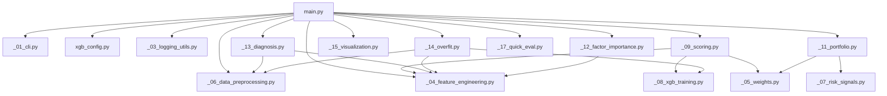

# ml_models

本目录包含用于多因子选股/权重生成的模型脚本与其模块化组件。目前主要入口为：

- [main.py](file:///Users/zhuzhuxia/Documents/SZU_w4/ml_models/main.py)：基于 XGBoost（可选融合 KNN）的日频滚动训练与打分，生成逐日权重文件；内置“创业板+科创板”收缩股票池与“趋势/动量”为主的默认配置；支持诊断模式与过拟合自检。
- [xgb_config.py](file:///Users/zhuzhuxia/Documents/SZU_w4/ml_models/xgb_config.py)：默认配置集中管理（数据/模型/训练/组合/择时等）。
- [model_functions/](file:///Users/zhuzhuxia/Documents/SZU_w4/ml_models/model_functions)：功能模块拆分（数据预处理、特征工程、训练、评估、可视化、组合构建等）。

兼容性说明：
- [xgb_knn_runner_tech.py](file:///Users/zhuzhuxia/Documents/SZU_w4/ml_models/xgb_knn_runner_tech.py) 仍可作为旧入口使用（会直接转到 `main.py` 执行）。

---


## 程序结构与运行方式

> 注：大部分 `_xx_*.py` 模块为内部函数库，不支持直接运行，需通过 `main.py` 配合不同参数调用。

```
ml_models/
  main.py                     # 主入口 -> python ml_models/main.py --help
  xgb_config.py               # 静态配置 -> (不可运行，仅供导入)
  xgb_knn_runner_tech.py      # 旧入口 -> python ml_models/xgb_knn_runner_tech.py ...
  model_functions/
    _01_cli.py                # 参数解析 -> python ml_models/main.py --help
    _02_parsing_utils.py      # 工具函数 -> (内部库)
    _03_logging_utils.py      # 日志工具 -> (内部库)
    _04_feature_engineering.py# 特征工程 -> (内部库，主流程自动调用)
    _05_weights.py            # 权重计算 -> (内部库，主流程自动调用)
    _06_data_preprocessing.py # 数据预处理 -> (内部库，主流程自动调用)
    _07_risk_signals.py       # 风控信号 -> (内部库，--timing-method index_ma20 时调用)
    _08_xgb_training.py       # 模型训练 -> (内部库，主流程自动调用)
    _09_scoring.py            # 预测打分 -> (内部库，主流程自动调用)
    _10_evaluation.py         # 评估指标 -> (内部库)
    _11_portfolio.py          # 组合构建 -> (内部库，主流程自动调用)
    _12_factor_importance.py  # 因子重要性 -> (内部库，主流程结束前自动调用)
    _13_diagnosis.py          # 因子诊断 -> python ml_models/main.py --diagnose ...
    _14_overfit.py            # 过拟合自检 -> python ml_models/main.py --overfit-check ...
    _15_visualization.py      # 可视化绘图 -> (内部库)
    _16_run_params.py         # 参数记录 -> (内部库)
    _17_quick_eval.py         # 快速评估 -> python ml_models/main.py --quick-eval ...
```

---

## 模块依赖关系图



---

## 运行概览（与原逻辑一致）

### 核心思路

- **股票池**：仅保留代码前缀为 `300`（创业板）与 `688`（科创板）的股票。
- **特征**：读取本地因子面板（MultiIndex：`date, code`），对每只股票做 `shift(1)`，避免未来函数。
- **标签（Label）**：计算复合未来收益（开盘买入口径）`ret_next_raw = 0.5*ret_5d + 0.5*ret_10d`，再减去同日基准（默认：**可交易股票池的横截面中位数**）得到超额收益 `ret_next`。
- **训练方式**：对每个交易日滚动用过去 `train_window` 天训练一次，输出当天全股票池的预测分数。
- **持仓生成**：对预测分数做 `smooth_window` 日均值平滑，用“TopK 买入 / TopBuffer 持有”缓冲区 + 惯性因子 + 调仓周期控制换手，并输出逐日权重 CSV。
- **可交易过滤（用于标签/候选过滤）**：要求 `open>0`；若存在 `upper_limit` 则要求 `open<upper_limit`（避免涨停不可买）；若存在 `turnover_prev` 则要求 `turnover_prev > 1500万`。

---

## 输入数据

脚本内置了固定路径（如需迁移，可直接在脚本顶部改常量）：

- 因子数据：`/Users/zhuzhuxia/Documents/SZU_w4/factors_data/all_factors_with_fundamentals.parquet`
- 价格数据：`/Users/zhuzhuxia/Documents/SZU_w4/pre_data/cleaned_stock_data_300_688_with_idxstk.parquet`
- 风控数据（当 `--timing-method index_ma20/index_ma_dual` 时使用）：`/Users/zhuzhuxia/Documents/SZU_w4/pre_data/merged_20200101_20241231.csv`（读取指数 `close` 计算 MA，并默认用前一交易日信号）

期望格式：

- 因子数据需包含 MultiIndex：`date, code`（或包含 `date/code` 列可自动转为 MultiIndex）。
- 价格数据需包含 MultiIndex：`date, code`，至少包含 `open/close`，建议包含 `upper_limit/lower_limit/turnover`（用于可交易与涨跌停判断）。

---

## 输出结果

### 1) 权重文件（逐日）

- 输出目录：`/Users/zhuzhuxia/Documents/SZU_w4/ml_results/xgb_results_gem_star_momo`
- 文件名：`YYYYMMDD.csv`
- 格式：无表头，两列（`code, weight`）

注意：每次运行会自动清空该目录下旧的 `*.csv`（避免“上次权重未覆盖干净”）。

### 2) 临时分数文件

- 目录：`/Users/zhuzhuxia/Documents/SZU_w4/ml_results/temp_scores_gem_star_momo`
- 文件名：`YYYYMMDD.parquet`
- 内容：当天的候选股票分数（脚本会在运行开始时删除并重建该目录）。

### 3) 因子重要性

- 目录：`/Users/zhuzhuxia/Documents/SZU_w4/ml_results/factors_importance`
- 文件：`factor_importance_*.csv / *.meta.json / *.brief.txt`
- 说明：用最后一个预测日对应训练集拟合一次 XGBoost，输出 gain/weight/cover 以及与标签的 spearman 相关等摘要。

---

## 快速开始

### 生成权重（正常模式）

在工程根目录执行：

```bash
python "/Users/zhuzhuxia/Documents/SZU_w4/ml_models/main.py" \
  --start-date 20230101 \
  --end-date 20241231 \
  --n-workers 8 \
  --quick-eval
```

运行输出示例（部分）：
```text
[配置参数]
┌── 基础路径
│ output_dir: ...   sub_dir_name: xgb_results_gem_star_momo
...
┌── 模型参数
│ n_estimators: 200   learning_rate: 0.01   max_depth: 4
...
```

如果你只想快速验证流程是否跑通：

```bash
python "/Users/zhuzhuxia/Documents/SZU_w4/ml_models/main.py" \
  --start-date 20240102 \
  --end-date 20240120 \
  --max-predict-days 1 \
  --n-workers 1 \
  --quick-eval
```

### 因子诊断（不训练，快速看因子方向）

```bash
python "/Users/zhuzhuxia/Documents/SZU_w4/ml_models/main.py" \
  --diagnose \
  --diag-start-date 20230101 \
  --diag-end-date 20241231 \
  --diag-step 5 \
  --diag-top-k 30 \
  --diag-min-n 300
```

### 快速评估（独立运行，不训练）

如果你已有生成的权重文件（在 `output_dir/sub_dir_name` 下），只想单独运行快速评估：

```bash
python "/Users/zhuzhuxia/Documents/SZU_w4/ml_models/main.py" \
  --quick-eval-only
```

诊断输出：

- 终端打印每年 Top/Bottom 10 因子（按 IC Mean 排序），并给出“趋势/反转/冲突/弱”的方向建议。
- 同时在脚本所在目录生成 `diagnose_*.txt` 便于留档。

---

## 常用参数说明（按用途）

### 训练/模型

- `--train-window`：训练窗口长度（交易日），默认 250。
- `--n-estimators / --learning-rate / --max-depth`：XGBoost 复杂度参数。
- `--subsample / --reg-lambda`：XGBoost 采样与正则参数。
- `--xgb-objective`：默认 `reg:squarederror`；也可用 `rank:*` 目标（脚本内已兼容 XGBRanker）。
- `--use-knn`：是否融合 KNN（对 X 特征做 StandardScaler，再做 rank blend）。
- `--knn-neighbors`：KNN 近邻数上限（会自动裁剪到样本量允许范围）。
- `--blend-xgb-weight / --blend-knn-weight`：rank blend 权重。
- `--dropna-features`：是否对合并后的训练集整体 `dropna()`（更严格但样本可能显著减少）。
- `--sample-weight-mode`：训练样本权重，支持 `none/time_decay_exp/time_decay_linear`。
- `--decay-anchor-days / --decay-half-life-days / --decay-min-weight`：时间衰减权重参数。
- `--use-constraints`：是否启用单调约束。

### 标签/超额收益基准

- `--label-benchmark-universe`：
  - `tradable`（默认）：基准只在“可交易股票”里计算，更贴近真实交易池。
  - `all`：在当日全样本上计算基准。

### 交易执行/换手控制

- `--top-k`：目标持仓数（买入 TopK）。
- `--buffer-k`：缓冲持有区（掉出 TopBuffer 才卖）。
- `--rebalance-period`：调仓间隔（交易日）。
- `--rebalance-turnover-cap`：单次调仓最多引入的新股票数量比例（通过限制新买入数实现）。
- `--smooth-window`：分数平滑窗口（对最近 N 日分数取均值）。
- `--inertia-ratio`：对已持仓股票分数乘以惯性系数，减少来回切换。
- `--emergency-exit-rank`：非调仓日触发止损/剔除的排名阈值（脚本会保留足够的日度候选以支持该逻辑）。
- `--band-threshold`：小权重/小交易过滤阈值（低于阈值的卖出/买入会被忽略）。
- `--max-w`：单票最大权重（基于等权买入后再做 cap 并重分配）。
- `--min-weight`：最小持仓权重（低于阈值的买入权重会被置 0）。
- `--non-rebalance-action`：
  - `empty`（默认）：非调仓日输出空文件
  - `carry`：非调仓日输出延续上次权重（可选叠加择时缩放）
- `--limit-policy`：
  - `freeze`（默认）：涨跌停/不可买的老仓位强制保留（避免“想卖卖不掉”导致权重跳变）
  - `sell_only`：更保守的卖出策略（按脚本实现逻辑执行）

### 择时（仓位开关）

- `--timing-threshold`：单阈值择时基准（默认 0.0）。
- `--timing-enter-threshold / --timing-exit-threshold`：双阈值迟滞，避免频繁开平仓。
- `--timing-hysteresis`：未显式指定 enter 阈值时，enter=exit+hysteresis。
- `--timing-bad-exposure`：择时关闭时的仓位缩放（例如 0.5 表示半仓；0 表示空仓）。
- `--timing-method`：`index_ma20/index_ma_dual/score/none`（默认 `index_ma20`）。
- `--risk-data-path / --risk-index-code`：风控数据路径与指数代码（默认 `399006`）。
- `--risk-ma-window`：单均线窗口（`index_ma20`）。
- `--risk-ma-fast-window / --risk-ma-slow-window`：双均线窗口（`index_ma_dual`）。
- `--risk-ma-buffer`：均线择时缓冲带，减少来回切换（对 `index_ma20/index_ma_dual` 生效）。

### 过拟合自检（可选）

- `--overfit-check`：开启过拟合自检（可单点/区间）。
- `--overfit-target-date / --overfit-valid-days`：指定目标预测日与 valid 天数（默认 20）。
- `--overfit-range / --overfit-range-step / --overfit-range-max-points`：区间抽样自检参数。
- `--overfit-along`：在主流程中“边跑边做”自检（适合调参时快速回看）。

### 快速评估（正式回测前）

- `--quick-eval / --no-quick-eval`：是否在权重生成后自动做一次快速评估（默认 false）。
- `--quick-eval-level`：输出详细程度（0/1/2，默认 1）。
- `--quick-eval-dir-name`：评估输出目录名（默认 `quick_eval`，输出到 `output_dir/quick_eval/<sub_dir_name>/`）。
- `--quick-eval-cache / --no-quick-eval-cache`：是否启用增量缓存（默认 true）。

- `--quick-eval-risk-free`：年化无风险利率（用于夏普，默认 0）。
- `--quick-eval-fee-rate`：单边手续费率（按调仓换手估算双边成本，默认 0.0003）。
- `--quick-eval-slippage`：单边滑点率（正值=成本，负值=被动成交收益，默认 0.0）。
- `--quick-eval-capital`：评估本金（用于输出期末资金/手续费金额，默认 10000000）。

快速评估输出示例（默认）：

- HTML 报告：`/Users/zhuzhuxia/Documents/SZU_w4/ml_results/quick_eval/xgb_results_gem_star_momo/quick_eval_report.html`
- 日度缓存：`/Users/zhuzhuxia/Documents/SZU_w4/ml_results/quick_eval/xgb_results_gem_star_momo/daily_cache.parquet`
- 报告内容：净值曲线、胜率分解、超额收益分布、月度收益热力图、以及按月汇总的“被动卖出/减持”统计与换手/手续费摘要。

---

## 特征过滤规则（重要）

脚本除了 `DEFAULT_DROP_FACTORS` 外，还硬性应用了一条规则：

- 所有 `turnover_*` 因子默认剔除，仅保留 `turnover_bias_5`。

你可以用：

- `--use-default-drop-factors false` 关闭默认 drop list
- `--drop-factors "a,b,c"` 追加 drop 因子
- `--constraints "factor1:1,factor2:-1"` 覆盖/追加单调约束（只接受 -1/0/1，0 会被忽略）

---

## 模块调用示例

### 1) 仅加载数据并检查面板规模

```python
from ml_models.model_functions._01_cli import parse_args
from ml_models.model_functions._03_logging_utils import build_logger
from ml_models.model_functions._06_data_preprocessing import prepare_dataset

args = parse_args([])
logger = build_logger(log_dir="/Users/zhuzhuxia/Documents/SZU_w4/ml_results/logs", run_name="debug")
df_ml, df_price = prepare_dataset(args, logger=logger)
print(df_ml.shape, df_price.shape)
```

### 2) 仅生成组合（使用已存在的 temp_scores parquet）

```python
from ml_models.model_functions._01_cli import parse_args
from ml_models.model_functions._03_logging_utils import build_logger
from ml_models.model_functions._11_portfolio import generate_positions_with_buffer
import pandas as pd

args = parse_args([])
logger = build_logger(log_dir="/Users/zhuzhuxia/Documents/SZU_w4/ml_results/logs", run_name="portfolio_only")
df_price = pd.read_parquet(args.price_data_path).sort_index()
generate_positions_with_buffer(args, temp_dir="/Users/zhuzhuxia/Documents/SZU_w4/ml_results/temp_scores_gem_star_momo",
                               save_dir="/Users/zhuzhuxia/Documents/SZU_w4/ml_results/xgb_results_gem_star_momo",
                               df_price=df_price, logger=logger)
```

---

## 功能扩展指南

- 新增功能应添加到 [model_functions/](file:///Users/zhuzhuxia/Documents/SZU_w4/ml_models/model_functions) 目录下。
- 文件命名按流程顺序编号，推荐形式为：`_03_new_feature.py`（用下划线开头以保证 Python 可正常 import）。
- 扩展实现保持输入输出兼容：尽量使用 `args`（命令行配置）、`df_ml`（MultiIndex: date, code 的面板，含 ret_next 标签）、`df_price`（价格面板）作为核心入参。
- 主流程预留标准接口：在 [main.py](file:///Users/zhuzhuxia/Documents/SZU_w4/ml_models/main.py) 中增加/调用新的模块时，放在 “Dataset/Features/Scoring/Portfolio” 相邻阶段，保持执行顺序与数据语义一致。
- README.md 中维护功能扩展说明：新增模块时同步更新“程序结构”和“依赖关系图”。
